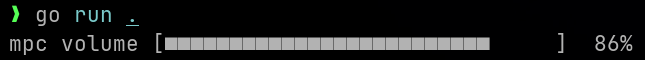

# mpc-vol
terminal volume controler for mpc

## Description
ほぼGeminiさんに作ってもらった、カーソルキーでmpcの音量を変えるコマンドラインユーティリティーです。

(BubbleTeaを勉強しようと思ってGeminiさんに聞きながら作ろうとしたら、いきなり完成系がでてきた(´・ω:;.:... )

mpc volumeだと音量の変化がわからないのでTUIで操作できるようにしたものです。

実際に聞きながら音量を変えられるのが便利だと思います。



## install

```bash
go install github.com/oja-bitterlife/mpc-vol
```

goのbinにパスが通っていればこれで動きます。


## Usage

- ↑ / ↓ : 5% ずつ調整
- ← / → : 1% ずつ調整
- Enter / Esc / q : 終了（現在の設定値を標準出力に残します）

